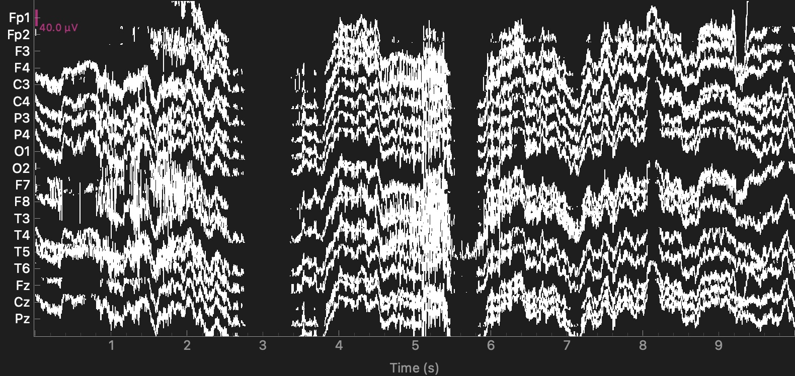
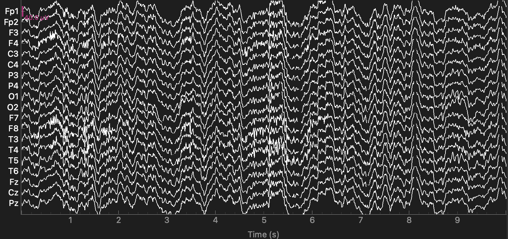
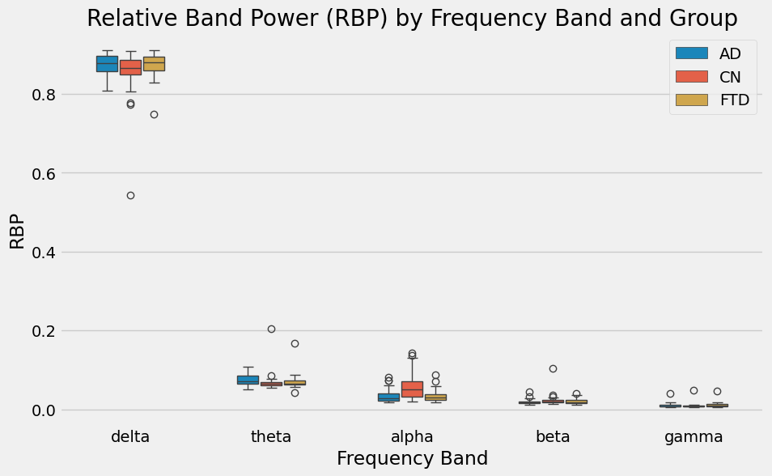

## EEG-Based Classification of Alzheimer's Disease and Frontotemporal Dementia

This repository contains a full machine learning pipeline for preprocessing EEG data and training classifiers to distinguish between Alzheimer's disease (AD), frontotemporal dementia (FTD), and healthy control (CN) subjects.

## Pipeline Overview

1. **Subject Metadata Loading**
   - Loads subject IDs and diagnostic groups from `participants.tsv`

2. **EEG Preprocessing**
   - **Bandpass Filter**: 0.5–45 Hz (Butterworth): Removes non-physiological noise
   - **ASR (Artifact Subspace Reconstruction)**: Removes persistent or extreme outlier artifacts
   - **ICA (Independent Component Analysis)**: Removes eye and muscle artifacts

3. **Epoching**
   - Segments EEG into overlapping 4-second windows with 0.5s overlap

4. **Feature Extraction**
   - Computes Relative Band Power (RBP) across:
     - Delta (0.5–4 Hz)
     - Theta (4–8 Hz)
     - Alpha (8–13 Hz)
     - Beta (13–25 Hz)
     - Gamma (25–45 Hz)
   - Power Spectral Density (PSD) estimated using Welch's method
   - RBP is calculated by dividing absolute band power by total power, averaged across channels and epochs

5. **Visualization**
   - Boxplot comparing RBP distributions across diagnostic groups

6. **Modeling**
   - Performs Leave-One-Out cross-validation
   - Classifiers tested:
     - LightGBM
     - SVM (Support Vector Machines)
     - KNN (K-Nearest Neighbors)
     - MLP (Multi-layer Perceptron)
     - Random Forest
   - Identifies best model and feature subset for:
     - AD vs. CN classification
     - FTD vs. CN classification

## Results

- Achieved 76.92% accuracy in classifying AD vs. CN subjects
  - Optimal model: LightGBM
  - Optimal features: delta, theta, alpha, and beta RBPs
- Achieved 69.23% accuracy in classifying FTD vs. CN subjects
  - Optimal model: LightGBM
  - Optimal features: alpha and beta RBPs
  - Observation: The same accuracy was achieved using just these two bands as with 3-, 4-, or all 5-band combinations, suggesting alpha and beta bands carry the most discriminative power for FTD vs. CN
 
## Future Work

- Outlier detection and removal
- Optimize hyperparameters
- Extract additional features
- Include more detailed visualization of results (e.g. statistical significance)

## Data Source

EEG data is from the OpenNeuro ds004504 dataset:
- Data descriptor: 10.3390/data8060095
- First study on this dataset: 10.1109/ACCESS.2023.3294618

To use this pipeline, place the downloaded `.set` files and `participants.tsv` in the `data/raw` directory.
